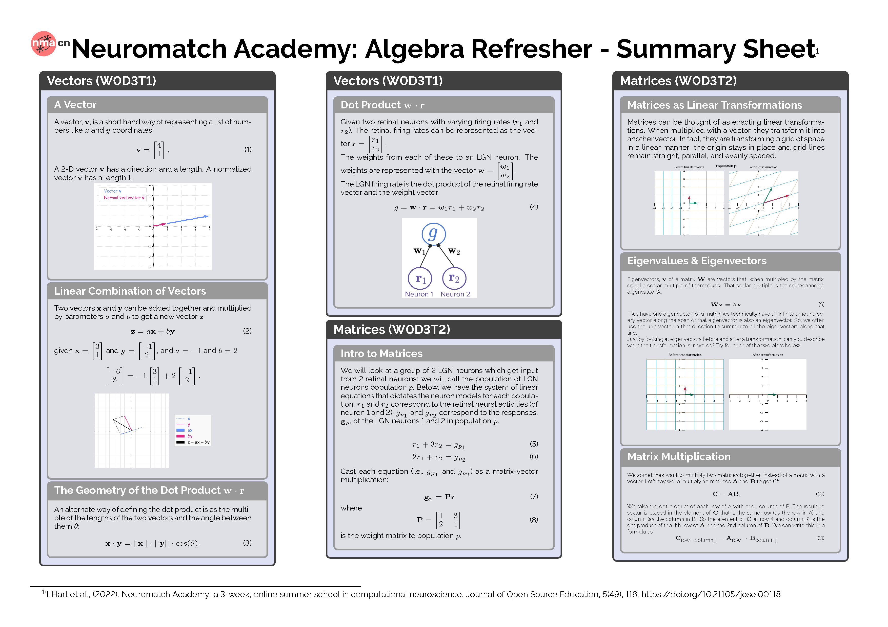

# Latex Code for Neuromatch Dynamical Systems Summary Sheets

This repository contains the latex code to generate the Dynamical Systems Summary Sheets for [Neuromatch Academy Computational Neuroscience Summer School 2022](https://compneuro.neuromatch.io/tutorials/intro.html)

The code is divided by day:
+ Linear Algebra (W0D3)
+ Calculus (W0D4)
+ Statistics (W0D4)

with the figures in the FIGURES folder.

All code was written using Overleaf below is the an example page.

If you do use the materials please cite 't Hart et al. (2022).

## Reference 
't Hart et al., (2022). Neuromatch Academy: a 3-week, online summer school in computational neuroscience. Journal of Open Source Education, 5(49), 118, https://doi.org/10.21105/jose.00118
